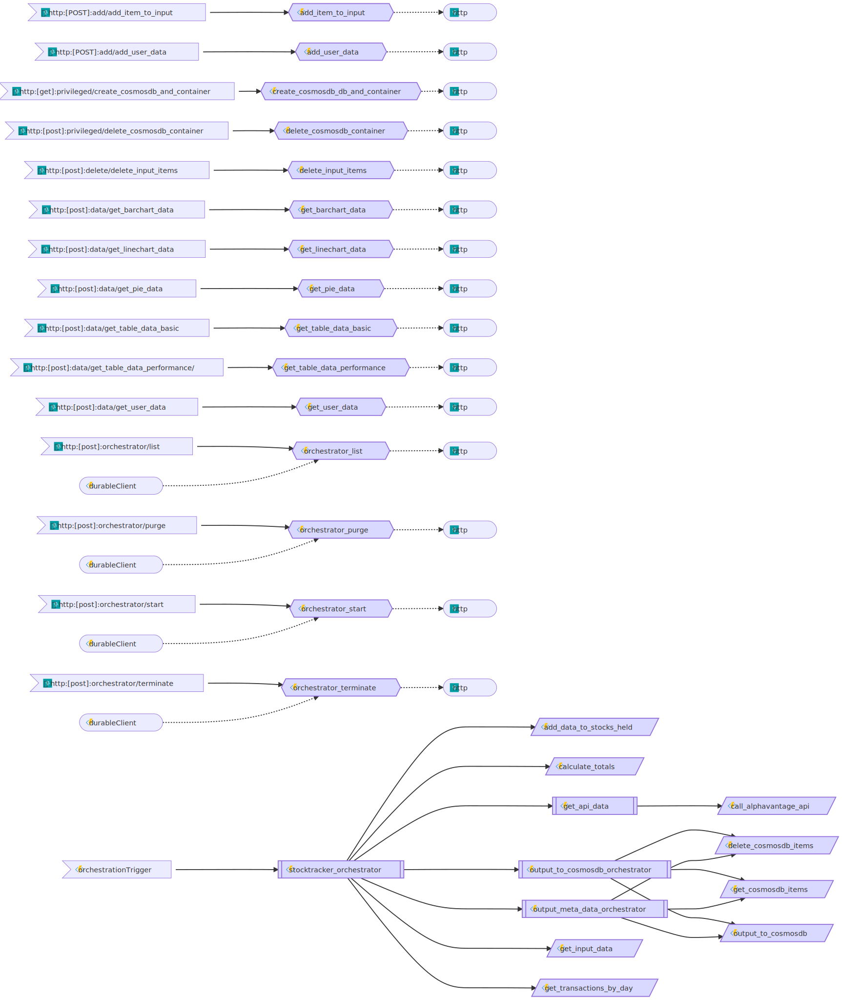

# StockTracker Project - API

  

 

  

The target of this project is to get data about your stock portfolio and make this viewable in a web application.

To see what's being worked on check out the [project board](https://github.com/users/JoranSlingerland/projects/1).

## Related repos

The project consists of three repositories:

| Name                                                                             | Notes                                       | Language |
| -------------------------------------------------------------------------------- | ------------------------------------------- | -------- |
| [API](https://github.com/JoranSlingerland/StockTracker)                          | This repo which will be used to gather data | Python   |
| [Frontend](https://github.com/JoranSlingerland/StockTracker-frontend)            | Frontend repo which will create the website | React    |
| [Infrastructure](https://github.com/JoranSlingerland/StockTrackerInfrastructure) | Code to deploy all resouces to Azure        | Bicep    |

## API

This project will be using the [Alpha vantage API](https://www.alphavantage.co/) and [clearbit API](https://clearbit.com/).

## Setup

### prerequisites

- Fork this repo and the [stocktracker-FrontEnd](https://github.com/JoranSlingerland/Stocktracker-FrontEnd) Repo.
- Get your api keys from [Alpha vantage API](https://www.alphavantage.co/) and [clearbit API](https://clearbit.com/)
- Generate a Github PAT with Repo and workflow permissions.

### Azure environment

For the azure enviorment you can either use the [One time deployment](#one-time-deployment) or the [Pipeline deployment](#pipeline-deployment)

#### One time deployment

- Run the deployment by [clicking Here](https://portal.azure.com/#create/Microsoft.Template/uri/https%3A%2F%2Fgist.githubusercontent.com%2FJoranSlingerland%2Fa9087b977db092d71212e442dd5c5975%2Fraw%2FStocktrackerBuild).
- I'd recommend not chaning any of the default values. But you can if you want to.

#### Pipeline deployment

- Fork the [Stocktracker Repo](https://github.com/JoranSlingerland/StockTrackerInfrastructure)
- You can remove the `bicep-build.yml` file as this is only used to create a gist for the one time deployment.
- Setup the workflow secrets as defined below:

| Name               | Value                                                                              |
| ------------------ | ---------------------------------------------------------------------------------- |
| AZURE_CREDENTIALS  | I'm not sure anymore but it has something to do with the azure/login@v1 action : ) |
| AZURE_SUBSCRIPTION | Your Azure subscription ID                                                         |
| SWA_REPO_TOKEN     | The PAT token you generated                                                        |

### local development environment

- Install the [azure cosmosDB emulator](https://learn.microsoft.com/en-us/azure/cosmos-db/local-emulator?tabs=ssl-netstd21)
- Install [Azurite](https://learn.microsoft.com/en-us/azure/storage/common/storage-use-azurite?tabs=github#install-azurite)
- Setup a .env file in the stocktracker root with the values below

| Name                      | Notes                     | Example                                          |
| ------------------------- | ------------------------- | ------------------------------------------------ |
| COSMOSDB_ENDPOINT         | < Link to your database>  | [https://localhost:8081](https://localhost:8081) |
| COSMOSDB_KEY              | < CosmosDB Access key >   | A1B2C3                                           |
| COSMOSDB_DATABASE         | < CosmosDB Database name> | stocktracker                                     |
| COSMOSDB_OFFER_THROUGHPUT | < CosmosDB Thoughput >    | 1000                                             |

- Startup the API running the task `func host start`
- run the command `swa start http://localhost:8080 --run "yarn run dev" --api-location http://localhost:7071` to start the website and SWA endpoint.
- Go to the website [http://localhost:4280/](http://localhost:4280/) and Login to the website. make sure you give yourself the admin role.

## Usage

- Go to /authenticated/settings admin page and create the containers.
- Go to /authenticated/settings Account page and add your api keys.
- Add data in /authenticated/actions
- Refresh the data by going to /authenticated/settings and clicking the refresh data button.
- After it has finished you can view the data

## Azure Functions

All Azure functions availible in the api.

### get_barchart_data

| Method | URL                                 | content-type | Usage                                |
| ------ | ----------------------------------- | ------------ | ------------------------------------ |
| POST   | {{base_url}}/data/get_barchart_data | form-data    | Function will get data for barcharts |

Body

| Param     | value      | Type | Allowed values                      | Required |
| --------- | ---------- | ---- | ----------------------------------- | -------- |
| userId    | {{userId}} | text | `string`                            | true     |
| dataType  |            | text | dividend \| transaction_cost        | true     |
| dataToGet |            | text | max \| year \| ytd \| month \| week | true     |

### get_table_data_basic

| Method | URL                                    | content-type | Usage                                 |
| ------ | -------------------------------------- | ------------ | ------------------------------------- |
| POST   | {{base_url}}/data/get_table_data_basic | form-data    | Function will get data used by tables |

Body

| Param           | value      | Type | Allowed values                          | Required |
| --------------- | ---------- | ---- | --------------------------------------- | -------- |
| userId          | {{userId}} | text | `string`                                | true     |
| containerName   |            | text | totals \| stocks_held \| input_invested | true     |
| andOr           |            | text | and \| or                               | false    |
| fullyRealized   |            | text | true \| false                           | false    |
| partialRealized |            | text | true \| false                           | false    |

### get_linechart_data

| Method | URL                                  | content-type | Usage                                 |
| ------ | ------------------------------------ | ------------ | ------------------------------------- |
| POST   | {{base_url}}/data/get_linechart_data | form-data    | Function will get data for linecharts |

Body

| Param     | value      | Type | Allowed values                      | Required |
| --------- | ---------- | ---- | ----------------------------------- | -------- |
| userId    | {{userId}} | text | `string`                            | true     |
| dataType  |            | text | invested_and_value \| total_gains   | true     |
| dataToGet |            | text | max \| year \| ytd \| month \| week | true     |

### get_pie_data

| Method | URL                            | content-type | Usage                                |
| ------ | ------------------------------ | ------------ | ------------------------------------ |
| POST   | {{base_url}}/data/get_pie_data | form-data    | Function will get data for piecharts |

Body

| Param    | value      | Type | Allowed values                          | Required |
| -------- | ---------- | ---- | --------------------------------------- | -------- |
| userId   | {{userId}} | text | `string`                                | true     |
| dataType | stocks     | text | stocks \| currency \| country \| sector | true     |

### get_table_data_performance

| Method | URL                                          | content-type | Usage                                 |
| ------ | -------------------------------------------- | ------------ | ------------------------------------- |
| POST   | {{base_url}}/data/get_table_data_performance | form-data    | Function will get data used by tables |

Body

| Param     | value      | Type | Allowed values                      | Required |
| --------- | ---------- | ---- | ----------------------------------- | -------- |
| userId    | {{userId}} | text | `string`                            | true     |
| dataToGet |            | text | max \| year \| ytd \| month \| week | true     |

### get_topbar_data

| Method | URL                               | content-type | Usage                             |
| ------ | --------------------------------- | ------------ | --------------------------------- |
| POST   | {{base_url}}/data/get_topbar_data | form-data    | Function will get data for topbar |

Body

| Param     | value      | Type | Allowed values                      | Required |
| --------- | ---------- | ---- | ----------------------------------- | -------- |
| userId    | {{userId}} | text | `string`                            | true     |
| dataToGet |            | text | max \| year \| ytd \| month \| week | true     |

Body

| Param     | value      | Type | Allowed values                      | Required |
| --------- | ---------- | ---- | ----------------------------------- | -------- |
| userId    | {{userId}} | text | `string`                            | true     |
| dataToGet |            | text | max \| year \| ytd \| month \| week | true     |

### orchestrator_start

| Method | URL                             | content-type | Usage                               |
| ------ | ------------------------------- | ------------ | ----------------------------------- |
| POST   | {{base_url}}/orchestrator/start | form-data    | Function will start an orchestrator |

Body

| Param        | value      | Type | Allowed values            | Required |
| ------------ | ---------- | ---- | ------------------------- | -------- |
| userId       | {{userId}} | text | `string`                  | true     |
| functionName |            | text | stocktracker_orchestrator | true     |
| daysToUpdate |            | text | all \| `int`              | true     |

### orchestrator_list

| Method | URL                            | content-type | Usage                            |
| ------ | ------------------------------ | ------------ | -------------------------------- |
| POST   | {{base_url}}/orchestrator/list | form-data    | Function will list orchestrators |

Body

| Param  | value      | Type | Allowed values | Required |
| ------ | ---------- | ---- | -------------- | -------- |
| userId | {{userId}} | text | `string`       | true     |
| days   |            | text | `int`          | true     |

### orchestrator_purge

| Method | URL                             | content-type | Usage                            |
| ------ | ------------------------------- | ------------ | -------------------------------- |
| POST   | {{base_url}}/orchestrator/purge | form-data    | Function will purge orchestrator |

Body

| Param      | value      | Type | Allowed values | Required |
| ---------- | ---------- | ---- | -------------- | -------- |
| userId     | {{userId}} | text | `string`       | true     |
| instanceId |            | text | `string`       | true     |

### orchestrator_terminate

| Method | URL                                 | content-type | Usage                                |
| ------ | ----------------------------------- | ------------ | ------------------------------------ |
| POST   | {{base_url}}/orchestrator/terminate | form-data    | Function will terminate orchestrator |

Body

| Param      | value      | Type | Allowed values | Required |
| ---------- | ---------- | ---- | -------------- | -------- |
| userId     | {{userId}} | text | `string`       | true     |
| instanceId |            | text | `string`       | true     |

### create_cosmosdb_and_container

| Method | URL                                                   | content-type | Usage                                         |
| ------ | ----------------------------------------------------- | ------------ | --------------------------------------------- |
| GET    | {{base_url}}/priveleged/create_cosmosdb_and_container | form-data    | Function will create a cosmosdb and container |

### delete_cosmosdb_container

| Method | URL                                               | content-type | Usage                                     |
| ------ | ------------------------------------------------- | ------------ | ----------------------------------------- |
| POST   | {{base_url}}/priveleged/delete_cosmosdb_container | form-data    | Function will delete a cosmosdb container |

Body

| Param              | value       | Type | Allowed values     | Required |
| ------------------ | ----------- | ---- | ------------------ | -------- |
| containersToDelete | output_only | text | all \| output_only | true     |

### delete_input_items

| Method | URL                                    | content-type | Usage                                                        |
| ------ | -------------------------------------- | ------------ | ------------------------------------------------------------ |
| POST   | {{base_url}}/delete/delete_input_items | json         | Function will delete a list of items in the input containers |

Body

Body needs to confirm to either of the schema found in the [schema](.\shared_code\schemas.py) file.

### add_item_to_input

| Method | URL                                | content-type | Usage                           |
| ------ | ---------------------------------- | ------------ | ------------------------------- |
| POST   | {{base_url}}/add/add_item_to_input | json         | Function will add item to input |

Body

Body needs to confirm to either of the schema found in the [schema](.\shared_code\schemas.py) file.

### add_user_data

| Method | URL                            | content-type | Usage                          |
| ------ | ------------------------------ | ------------ | ------------------------------ |
| POST   | {{base_url}}/add/add_user_data | json         | Function will update user data |

Body

Body needs to confirm to the schema found in the [schema](.\shared_code\schemas.py) file.

### get_user_data

| Method | URL                             | content-type | Usage                       |
| ------ | ------------------------------- | ------------ | --------------------------- |
| POST   | {{base_url}}/data/get_user_data | form-data    | Function will get user data |

Body

| Param  | value       | Type | Allowed values | Required |
| ------ | ----------- | ---- | -------------- | -------- |
| userId | output_only | text | `string`       | true     |

### Main stocktracker function

| Function                  | Usage                                                                                                                                    | Link and options                                              |
| ------------------------- | ---------------------------------------------------------------------------------------------------------------------------------------- | ------------------------------------------------------------- |
| stocktracker_orchestrator | Function will get all the data from the input tables and use this to create the ouput data. This will then be outputted to the CosmosDB. | /api/orchestrators/stocktracker_orchestrator/{days_to_update} |

Function will get all the data from the input tables and use this to create the ouput data. This will then be outputed to the CosmosDB.

### functions diagram

graph generated by [az-func-as-a-graph](https://github.com/scale-tone/az-func-as-a-graph)
