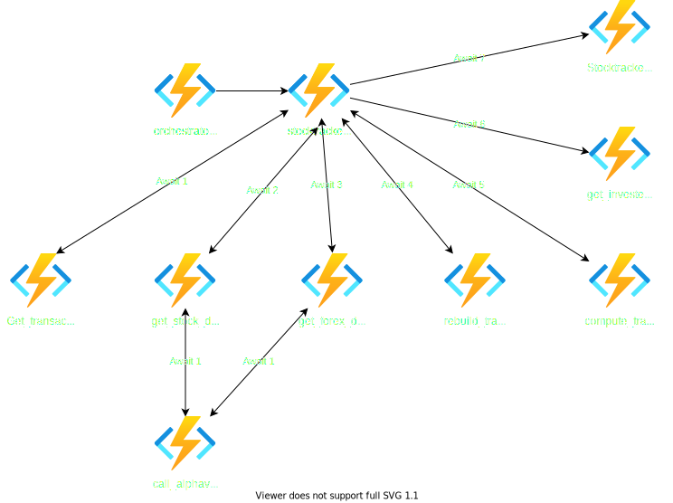

# StockTracker Project - API

  [](https://www.codefactor.io/repository/github/joranslingerland/stocktracker)   

The target of this project is to get data about your stock portfolio and make this viewable in a web application.

## Related repos

The project consists of three repositories:

| Name                                                                             | Notes                                       | Language |
| -------------------------------------------------------------------------------- | ------------------------------------------- | -------- |
| [API](https://github.com/JoranSlingerland/StockTracker)                          | This repo which will be used to gather data | Python   |
| [Frontend](https://github.com/JoranSlingerland/StockTracker-frontend)            | Frontend repo which will create the website | React    |
| [Infrastructure](https://github.com/JoranSlingerland/StockTrackerInfrastructure) | Code to deploy all resouces to Azure        | Bicep    |

## API

This project will be using the [Alpha vantage API](https://www.alphavantage.co/) and [clearbit API](https://clearbit.com/).

## Setup

### Basic environment setup

- Fork this repo and the [stocktracker-FrontEnd](https://github.com/JoranSlingerland/Stocktracker-FrontEnd) Repo.
- Get your api keys from [Alpha vantage API](https://www.alphavantage.co/) and [clearbit API](https://clearbit.com/)

### Azure environment

- Generate a Github PAT with Repo and workflow permissions.

#### One time deployment

- Run the deployment by [clicking Here](https://portal.azure.com/#create/Microsoft.Template/uri/https%3A%2F%2Fgist.githubusercontent.com%2FJoranSlingerland%2Fa9087b977db092d71212e442dd5c5975%2Fraw%2FStocktrackerBuild).
- I'd recommend not chaning any of the default values. But you can if you want to.

#### Pipeline deployment

- Fork the [Stocktracker Repo](https://github.com/JoranSlingerland/StockTrackerInfrastructure)
- You can remove the `bicep-build.yml` file as this is only used to create a gist for the one time deployment.
- Setup the workflow secrets as defined below:

| Name               | Value                                                                              |
| ------------------ | ---------------------------------------------------------------------------------- |
| Api_key            | < Your Alpha vantage API key >                                                     |
| AZURE_CREDENTIALS  | I'm not sure anymore but it has something to do with the azure/login@v1 action : ) |
| AZURE_SUBSCRIPTION | Your Azure subscription ID                                                         |
| clearbit_Api_key   | < Your clearbit API key >                                                          |
| Database           | < Your database name >                                                             |
| Server             | tcp:< Your server address >                                                        |
| SQLPassword        | < Your sql password >                                                              |
| SWA_REPO_TOKEN     | The PAT token you generated                                                        |

### local development environment

- Setup a sql server locally or use the one deployed to Azure.
- Setup a .env file in the stocktracker root with the values below

| Name             | Value                          |
| ---------------- | ------------------------------ |
| Server           | tcp:< Your server address >    |
| Database         | < Your database name >         |
| User             | < Your database user>          |
| Password         | < Your sql password >          |
| Api_key          | < Your Alpha vantage API key > |
| clearbit_Api_key | < Your clearbit API key >      |

- Startup the server by pressing `f5` in vscode and running the command `swa start http://localhost:8080 --run "npm run dev" --api-location http://localhost:7071`
- Login to the website by going to [http://localhost:4280/](http://localhost:4280/) and make sure you give yourself the admin role

## Usage

- Create the tables by running the create_sql_tables_orchestrator function.
  This can be done by browsing to [http://localhost:7071/api/create_sql_tables](http://localhost:7071/api/create_sql_tables)
- insert your data in the sql server with the below commands:

```sql
INSERT INTO input_transactions
VALUES ('T', '2020-03-25', 280.80, 10, 'Buy', 0.54, 'USD', 'att.com');

INSERT INTO input_transactions
VALUES ('AMD', '2020-03-25', 233.90, 5, 'Buy', 0.52, 'USD', 'amd.com');

INSERT INTO input_invested
VALUES ('2019-01-21', 'Deposit', 100);

INSERT INTO input_invested
VALUES ('2020-01-21', 'Deposit', 200);
```

- Run the main function by browsing to [http://localhost:7071/api/orchestrators/stocktracker_orchestrator/all](http://localhost:7071/api/orchestrators/stocktracker_orchestrator/all)
- After it has finished running check the data by going to [http://localhost:4280/](http://localhost:4280/)

## Azure Functions

### create_sql_tables

Function will create sql tables for the project.


### delete_sql_tables

Function will delete the sql tables marked as candelete in the get_config helper function.


### truncate_sql_tables

Function will truncate the sql tables marked as cantruncate in the get_config helper function.


### Get table data

Function will get data from the sql server and prep it for use in the static web app tables.


### Get pie data

Function will get data from the sql server and prep it for use in the static web app pie graphs.


### Stocktracker

Function will get all the data from the input tables and use this to create the ouput data. This will then be outputted to the sql server.


