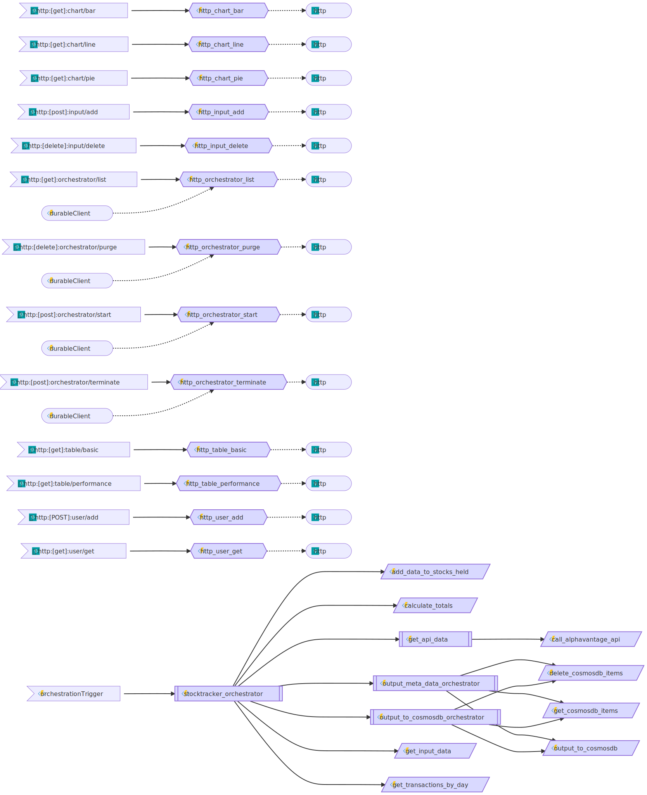

# StockTracker Project - API

  

 

  

The target of this project is to get data about your stock portfolio and make this viewable in a web application.

To see what's being worked on check out the [project board](https://github.com/users/JoranSlingerland/projects/1).

## Related repos

The project consists of three repositories:

| Name                                                                             | Notes                                       | Language |
| -------------------------------------------------------------------------------- | ------------------------------------------- | -------- |
| [API](https://github.com/JoranSlingerland/StockTracker)                          | This repo which will be used to gather data | Python   |
| [Frontend](https://github.com/JoranSlingerland/StockTracker-frontend)            | Frontend repo which will create the website | React    |
| [Infrastructure](https://github.com/JoranSlingerland/StockTrackerInfrastructure) | Code to deploy all resources to Azure       | Bicep    |

## Table of contents

- [StockTracker Project - API](#stocktracker-project---api)
  - [Related repos](#related-repos)
  - [Table of contents](#table-of-contents)
  - [API](#api)
  - [Setup](#setup)
    - [prerequisites](#prerequisites)
    - [Azure environment](#azure-environment)
      - [One time deployment](#one-time-deployment)
      - [Pipeline deployment](#pipeline-deployment)
    - [local development environment](#local-development-environment)
  - [Usage](#usage)
  - [Azure Functions](#azure-functions)
    - [Orchestrator](#orchestrator)
      - [start](#start)
        - [Query parameters](#query-parameters)
      - [list](#list)
        - [Query parameters](#query-parameters-1)
      - [purge](#purge)
        - [Query parameters](#query-parameters-2)
      - [terminate](#terminate)
        - [Query parameters](#query-parameters-3)
    - [Chart](#chart)
      - [bar](#bar)
        - [Query parameters](#query-parameters-4)
      - [line](#line)
        - [Query parameters](#query-parameters-5)
      - [pie](#pie)
        - [Query parameters](#query-parameters-6)
    - [input](#input)
      - [delete](#delete)
        - [Body](#body)
      - [add](#add)
        - [Body](#body-1)
    - [table](#table)
      - [basic](#basic)
        - [Query parameters](#query-parameters-7)
      - [performance](#performance)
        - [Query parameters](#query-parameters-8)
    - [user](#user)
      - [add](#add-1)
        - [Body](#body-2)
      - [get](#get)
    - [Main stocktracker function](#main-stocktracker-function)
    - [functions diagram](#functions-diagram)

## API

This project makes use of the [Alpha vantage API](https://www.alphavantage.co/) and [clearbit API](https://clearbit.com/).

## Setup

### prerequisites

- Fork this repo and the [stocktracker-FrontEnd](https://github.com/JoranSlingerland/Stocktracker-FrontEnd) Repo.
- Get your api keys from [Alpha vantage API](https://www.alphavantage.co/) and [clearbit API](https://clearbit.com/)
- Generate a Github PAT with Repo and workflow permissions.

### Azure environment

For the azure environment you can either use the [One time deployment](#one-time-deployment) or the [Pipeline deployment](#pipeline-deployment)

#### One time deployment

- Run the deployment by [clicking Here](https://portal.azure.com/#create/Microsoft.Template/uri/https%3A%2F%2Fgist.githubusercontent.com%2FJoranSlingerland%2Fa9087b977db092d71212e442dd5c5975%2Fraw%2FStocktrackerBuild).
- I'd recommend not changing any of the default values. But you can if you want to.

#### Pipeline deployment

- Fork the [Stocktracker Repo](https://github.com/JoranSlingerland/StockTrackerInfrastructure)
- You can remove the `bicep-build.yml` file as this is only used to create a gist for the one time deployment.
- Setup the workflow secrets as defined below:

| Name               | Value                                                                              |
| ------------------ | ---------------------------------------------------------------------------------- |
| AZURE_CREDENTIALS  | I'm not sure anymore but it has something to do with the azure/login@v1 action : ) |
| AZURE_SUBSCRIPTION | Your Azure subscription ID                                                         |
| SWA_REPO_TOKEN     | The PAT token you generated                                                        |

### local development environment

- Install the [azure cosmosDB emulator](https://learn.microsoft.com/en-us/azure/cosmos-db/local-emulator?tabs=ssl-netstd21)
- Install Azurite: `npm install -g azurite`
- Install static web apps cli: `npm install -g @azure/static-web-apps-cli`
- Setup a .env file in the stocktracker root with the values below

| Name                      | Notes                     | Example                                          |
| ------------------------- | ------------------------- | ------------------------------------------------ |
| COSMOSDB_ENDPOINT         | < Link to your database>  | [https://localhost:8081](https://localhost:8081) |
| COSMOSDB_KEY              | < CosmosDB Access key >   | A1B2C3                                           |
| COSMOSDB_DATABASE         | < CosmosDB Database name> | stocktracker                                     |
| COSMOSDB_OFFER_THROUGHPUT | < CosmosDB Throughput >   | 1000                                             |

- Startup the API running the task `func host start`
- run the command `swa start http://localhost:8080 --run "yarn run dev" --api-location http://localhost:7071` to start the website and SWA endpoint.
- Go to the website [http://localhost:4280/](http://localhost:4280/) and Login to the website. make sure you give yourself the admin role.

## Usage

- Go to /authenticated/settings Account page and add your api keys.
- Add data in /authenticated/actions
- Refresh the data by going to /authenticated/settings and clicking the refresh data button.
- After it has finished you can view the data

## Azure Functions

All Azure functions available in the api.

### Orchestrator

#### start

| Method | URL                             | Usage                               |
| ------ | ------------------------------- | ----------------------------------- |
| POST   | {{base_url}}/orchestrator/start | Function will start an orchestrator |

##### Query parameters

| Param        | Allowed values            | Required |
| ------------ | ------------------------- | -------- |
| functionName | stocktracker_orchestrator | true     |
| daysToUpdate | all \| `int`              | true     |

#### list

| Method | URL                            | Usage                            |
| ------ | ------------------------------ | -------------------------------- |
| GET    | {{base_url}}/orchestrator/list | Function will list orchestrators |

##### Query parameters

| Param | Allowed values | Required |
| ----- | -------------- | -------- |
| days  | `int`          | true     |

#### purge

| Method | URL                             | Usage                            |
| ------ | ------------------------------- | -------------------------------- |
| DELETE | {{base_url}}/orchestrator/purge | Function will purge orchestrator |

##### Query parameters

| Param      | Allowed values | Required |
| ---------- | -------------- | -------- |
| instanceId | `string`       | true     |

#### terminate

| Method | URL                                 | Usage                                |
| ------ | ----------------------------------- | ------------------------------------ |
| POST   | {{base_url}}/orchestrator/terminate | Function will terminate orchestrator |

##### Query parameters

| Param      | Allowed values | Required |
| ---------- | -------------- | -------- |
| instanceId | `string`       | true     |

### Chart

#### bar

| Method | URL                    | Usage                                |
| ------ | ---------------------- | ------------------------------------ |
| GET    | {{base_url}}/chart/bar | Function will get data for barcharts |

##### Query parameters

| Param     | Allowed values               | Required |
| --------- | ---------------------------- | -------- |
| allData   | `boolean`                    | false    |
| startDate | yyyy-mm-dd                   | false    |
| endDate   | yyyy-mm-dd                   | false    |
| dataType  | dividend \| transaction_cost | true     |

If allData is true then startDate and endDate can not be set. If allData is false then startDate and endDate must be set.

#### line

| Method | URL                     | Usage                                 |
| ------ | ----------------------- | ------------------------------------- |
| GET    | {{base_url}}/chart/line | Function will get data for linecharts |

##### Query parameters

| Param     | Allowed values                    | Required |
| --------- | --------------------------------- | -------- |
| allData   | `boolean`                         | false    |
| startDate | yyyy-mm-dd                        | false    |
| endDate   | yyyy-mm-dd                        | false    |
| dataType  | invested_and_value \| total_gains | true     |

If allData is true then startDate and endDate can not be set. If allData is false then startDate and endDate must be set.

#### pie

| Method | URL                    | Usage                                |
| ------ | ---------------------- | ------------------------------------ |
| GET    | {{base_url}}/chart/pie | Function will get data for piecharts |

##### Query parameters

| Param    | Allowed values                          | Required |
| -------- | --------------------------------------- | -------- |
| dataType | stocks \| currency \| country \| sector | true     |

### input

#### delete

| Method | URL                       | Usage                                                        |
| ------ | ------------------------- | ------------------------------------------------------------ |
| POST   | {{base_url}}/input/delete | Function will delete a list of items in the input containers |

##### Body

Body needs to confirm to the stock_input or transaction_input in the [schema](.\shared_code\schemas.py) file.

#### add

| Method | URL                    | content-type | Usage                           |
| ------ | ---------------------- | ------------ | ------------------------------- |
| POST   | {{base_url}}/input/add | json         | Function will add item to input |

##### Body

Body needs to confirm to the stock_input or transaction_input in the [schema](.\shared_code\schemas.py) file.

### table

#### basic

| Method | URL                      | Usage                                 |
| ------ | ------------------------ | ------------------------------------- |
| GET    | {{base_url}}/table/basic | Function will get data used by tables |

##### Query parameters

| Param           | Allowed values                                       | Required |
| --------------- | ---------------------------------------------------- | -------- |
| containerName   | input_invested \| input_transactions \| stocks_held" | true     |
| andOr           | and \| or                                            | false    |
| fullyRealized   | `Boolean`                                            | false    |
| partialRealized | `Boolean`                                            | false    |
| symbol          | `string`                                             | false    |

#### performance

| Method | URL                            | Usage                                 |
| ------ | ------------------------------ | ------------------------------------- |
| GET    | {{base_url}}/table/performance | Function will get data used by tables |

##### Query parameters

| Param         | Allowed values        | Required |
| ------------- | --------------------- | -------- |
| allData       | `boolean`             | false    |
| startDate     | yyyy-mm-dd            | false    |
| endDate       | yyyy-mm-dd            | false    |
| containerName | stocks_held \| totals | true     |

If allData is true then startDate and endDate can not be set. If allData is false then startDate and endDate must be set.

### user

#### add

| Method | URL                   | Usage                          |
| ------ | --------------------- | ------------------------------ |
| POST   | {{base_url}}/user/add | Function will update user data |

##### Body

Body needs to confirm to the user_data schema in the [schema](.\shared_code\schemas.py) file.

#### get

| Method | URL                   | Usage                       |
| ------ | --------------------- | --------------------------- |
| GET    | {{base_url}}/user/get | Function will get user data |

### Main stocktracker function

| Function                  | Usage                                                                                                                                     | Link and options                                              |
| ------------------------- | ----------------------------------------------------------------------------------------------------------------------------------------- | ------------------------------------------------------------- |
| stocktracker_orchestrator | Function will get all the data from the input tables and use this to create the output data. This will then be outputted to the CosmosDB. | /api/orchestrators/stocktracker_orchestrator/{days_to_update} |

Function will get all the data from the input tables and use this to create the output data. This will then be outputted to the CosmosDB.

### functions diagram

graph generated by [az-func-as-a-graph](https://github.com/scale-tone/az-func-as-a-graph)
